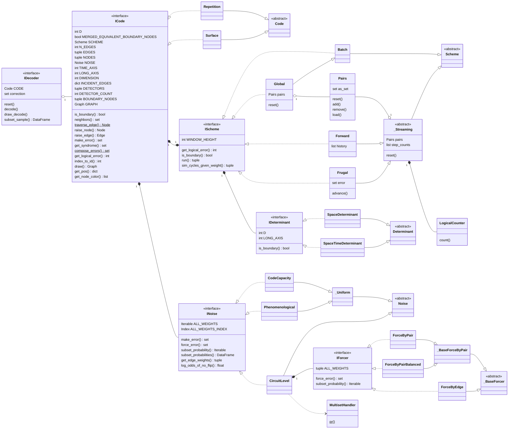
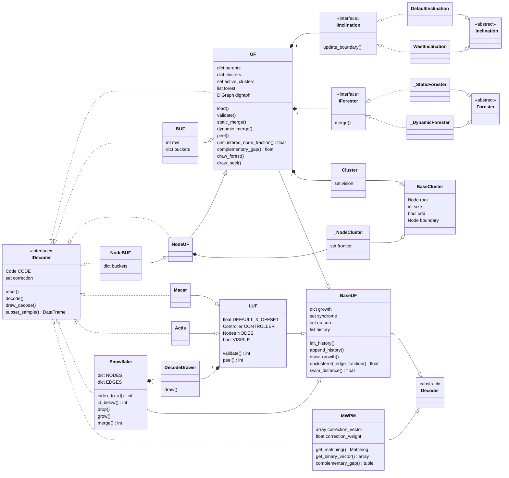
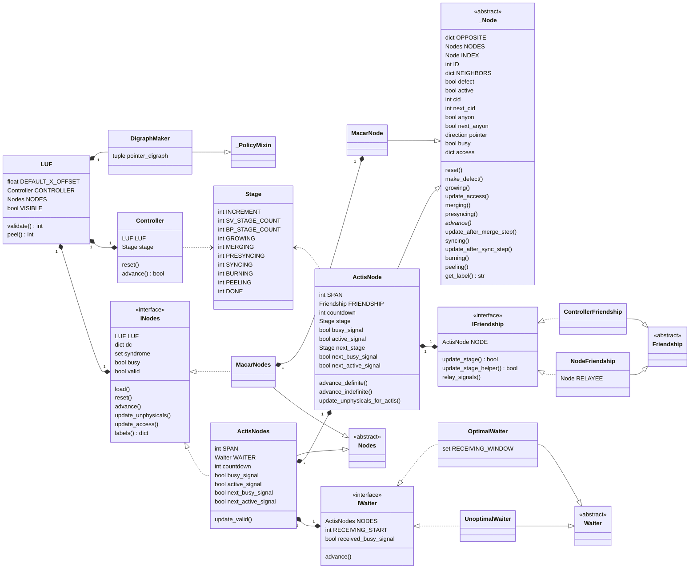
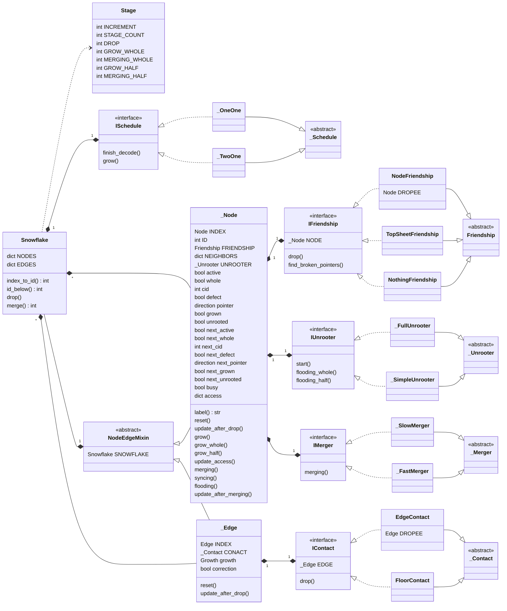

# Base Classes

```mermaid
classDiagram
direction LR

    class ICode{
        <<interface>>
        int D
        bool MERGED_EQUIVALENT_BOUNDARY_NODES
        Scheme SCHEME
        int N_EDGES
        tuple EDGES
        tuple NODES
        Noise NOISE
        int TIME_AXIS
        int LONG_AXIS
        int DIMENSION
        dict INCIDENT_EDGES
        tuple DETECTORS
        int DETECTOR_COUNT
        tuple BOUNDARY_NODES
        Graph GRAPH
        is_boundary() bool
        neighbors() set
        traverse_edge() Node$
        raise_node() Node
        raise_edge() Edge
        make_error() set
        get_syndrome() set
        compose_errors() set$
        get_logical_error() int
        index_to_id() int
        draw() Graph
        get_pos() dict
        get_node_color() list
    }
    class Code{<<abstract>>}

    Repetition --|> Code
    Surface --|> Code
    ICode <|.. Repetition
    ICode <|.. Surface

    class IDecoder{
        <<interface>>
        Code CODE
        set correction
        reset()
        decode()
        draw_decode()
        subset_sample() DataFrame
    }
    IDecoder "1" o-- ICode

    class IScheme{
        <<interface>>
        int WINDOW_HEIGHT
        get_logical_error() int
        is_boundary() bool
        run() tuple
        sim_cycles_given_weight() tuple
    }
    class Scheme{<<abstract>>}
    ICode "1" *--* "1" IScheme

    Batch --|> Scheme
    Global --|> Batch
    class Global{
        Pairs pairs
        reset()
    }
    class _Streaming{
        <<abstract>>
        Pairs pairs
        list step_counts
        reset()
    }
    Forward --|> _Streaming
    Forward: list history
    Frugal --|> _Streaming
    class Frugal{
        set error
        advance()
    }
    Global "1" o-- Pairs
    class Pairs{
        set as_set
        reset()
        add()
        remove()
        load()
    }
    Pairs --o "1" _Streaming
    _Streaming --|> Scheme
    _Streaming "1" *-- LogicalCounter
    LogicalCounter: count()
    IScheme <|.. Batch
    IScheme <|.. Global
    IScheme <|.. Forward
    IScheme <|.. Frugal

    class INoise{
        <<interface>>
        Iterable ALL_WEIGHTS
        Index ALL_WEIGHTS_INDEX
        make_error() set
        force_error() set
        subset_probability() Iterable
        subset_probabilities() DataFrame
        get_edge_weights() tuple
        log_odds_of_no_flip() float
    }
    class Noise{<<abstract>>}
    ICode "1" *-- INoise

    _Uniform --|> Noise
    CodeCapacity --|> _Uniform
    Phenomenological --|> _Uniform
    CircuitLevel --|> Noise
    INoise <|.. CodeCapacity
    INoise <|.. Phenomenological
    INoise <|.. CircuitLevel

    class IDeterminant{
        <<interface>>
        int D
        int LONG_AXIS
        is_boundary() bool
    }
    class Determinant{<<abstract>>}
    IScheme "1" *-- IDeterminant

    SpaceDeterminant --|> Determinant
    SpaceTimeDeterminant --|> Determinant
    IDeterminant <|.. SpaceDeterminant
    IDeterminant <|.. SpaceTimeDeterminant
    
    class IForcer{
        <<interface>>
        tuple ALL_WEIGHTS
        force_error() set
        subset_probability() Iterable
    }
    class _BaseForcer{<<abstract>>}
    CircuitLevel "1" *-- IForcer
    CircuitLevel ..> MultisetHandler
    MultisetHandler: pr()$

    _BaseForceByPair --|> _BaseForcer
    ForceByPair --|> _BaseForceByPair
    ForceByPairBalanced --|> _BaseForceByPair
    ForceByEdge --|> _BaseForcer
    IForcer <|.. ForceByPair
    IForcer <|.. ForceByPairBalanced
    IForcer <|.. ForceByEdge
```
# Decoders

```mermaid
classDiagram
direction LR

    class IDecoder{
        <<interface>>
        Code CODE
        set correction
        reset()
        decode()
        draw_decode()
        subset_sample() DataFrame
    }
    class Decoder{<<abstract>>}
    
    class BaseUF{
        dict growth
        set syndrome
        set erasure
        list history
        init_history()
        append_history()
        draw_growth()
        unclustered_edge_fraction() float
        swim_distance() float
    }
    BaseUF --|> Decoder

    class UF{
        dict parents
        dict clusters
        set active_clusters
        list forest
        DiGraph digraph
        load()
        validate()
        static_merge()
        dynamic_merge()
        peel()
        unclustered_node_fraction() float
        complementary_gap() float
        draw_forest()
        draw_peel()
    }
    class BUF{
        int mvl
        dict buckets
    }
    BUF --|> UF
    NodeUF --|> UF
    class NodeBUF{
        dict buckets
    }
    NodeBUF --|> NodeUF
    IDecoder <|.. UF
    IDecoder <|.. BUF
    IDecoder <|.. NodeUF
    IDecoder <|.. NodeBUF

    class BaseCluster{
        Node root
        int size
        bool odd
        Node boundary
    }
    class _Cluster{
        set vision
    }

    UF "1" *-- IInclination
    class IInclination{
        <<interface>>
        update_boundary()
    }
    IInclination <|.. DefaultInclination
    IInclination <|.. WestInclination
    class _Inclination{<<abstract>>}
    DefaultInclination --|> _Inclination
    WestInclination --|> _Inclination

    UF "1" *-- IForester
    class IForester{
        <<interface>>
        merge()
    }
    IForester <|.. _StaticForester
    IForester <|.. _DynamicForester
    class Forester{<<abstract>>}
    _StaticForester --|> Forester
    _DynamicForester --|> Forester

    UF "*" *-- _Cluster
    UF --|> BaseUF
    class _NodeCluster{
        set frontier
    }
    NodeUF "*" *-- _NodeCluster
    _Cluster --|> BaseCluster
    _NodeCluster --|> BaseCluster

    DecodeDrawer: draw()
    
    class LUF{
        float DEFAULT_X_OFFSET
        Controller CONTROLLER
        Nodes NODES
        bool VISIBLE
        validate() int
        peel() int
    }
    LUF --|> BaseUF
    DecodeDrawer --* "1" LUF
    IDecoder <|.. Macar
    IDecoder <|.. Actis
    Macar --|> LUF
    Actis --|> LUF

    class Snowflake{
        dict NODES
        dict EDGES
        index_to_id() int
        id_below() int
        drop()
        grow()
        merge() int
    }
    Snowflake "1" *-- DecodeDrawer
    Snowflake --|> BaseUF
    IDecoder <|.. Snowflake

    class MWPM{
        array correction_vector
        float correction_weight
        get_matching() Matching
        get_binary_vector() array
        complementary_gap() tuple
    }
    MWPM --|> Decoder
    IDecoder <|.. MWPM
```
# Macar/Actis

```mermaid
classDiagram
direction LR

    class LUF{
        float DEFAULT_X_OFFSET
        Controller CONTROLLER
        Nodes NODES
        bool VISIBLE
        validate() int
        peel() int
    }
    DigraphMaker: tuple pointer_digraph
    DigraphMaker --|> _PolicyMixin
    LUF "1" *-- DigraphMaker
    class Controller{
        LUF LUF
        Stage stage
        reset()
        advance() bool
    }
    LUF "1" *--* "1" Controller
    Controller ..> Stage
    class Stage{
        int INCREMENT
        int SV_STAGE_COUNT
        int BP_STAGE_COUNT
        int GROWING
        int MERGING
        int PRESYNCING
        int SYNCING
        int BURNING
        int PEELING
        int DONE
    }
    class INodes{
        <<interface>>
        LUF LUF
        dict dc
        set syndrome
        bool busy
        bool valid
        load()
        reset()
        advance()
        update_unphysicals()
        update_access()
        labels() dict
    }
    class Nodes{<<abstract>>}
    LUF "1" *--* "1" INodes
    class ActisNodes{
        int SPAN
        Waiter WAITER
        int countdown
        bool busy_signal
        bool active_signal
        bool next_busy_signal
        bool next_active_signal
        update_valid()
    }
    ActisNodes --|> Nodes
    INodes <|.. MacarNodes
    INodes <|.. ActisNodes
    class _Node{
        <<abstract>>
        dict OPPOSITE
        Nodes NODES
        Node INDEX
        int ID
        dict NEIGHBORS
        bool defect
        bool active
        int cid
        int next_cid
        bool anyon
        bool next_anyon
        direction pointer
        bool busy
        dict access
        reset()
        make_defect()
        growing()
        update_access()
        merging()
        presyncing()
        advance()*
        update_after_merge_step()
        syncing()
        update_after_sync_step()
        burning()
        peeling()
        get_label() str
    }
    MacarNode --|> _Node
    class ActisNode{
        int SPAN
        Friendship FRIENDSHIP
        int countdown
        Stage stage
        bool busy_signal
        bool active_signal
        Stage next_stage
        bool next_busy_signal
        bool next_active_signal
        advance_definite()
        advance_indefinite()
        update_unphysicals_for_actis()
    }
    Stage <.. ActisNode
    ActisNode --|> _Node
    MacarNodes "*" *--* "1" MacarNode
    MacarNodes --|> Nodes
    ActisNodes "*" *--* "1" ActisNode
    class IFriendship{
        <<interface>>
        ActisNode NODE
        update_stage() bool
        update_stage_helper() bool
        relay_signals()
    }
    class Friendship{<<abstract>>}
    ActisNode "1" *--* "1" IFriendship
    ControllerFriendship --|> Friendship
    NodeFriendship: Node RELAYEE
    NodeFriendship --|> Friendship
    IFriendship <|.. ControllerFriendship
    IFriendship <|.. NodeFriendship
    class IWaiter{
        <<interface>>
        ActisNodes NODES
        int RECEIVING_START
        bool received_busy_signal
        advance()
    }
    class Waiter{<<abstract>>}
    ActisNodes "1" *--* "1" IWaiter
    OptimalWaiter --|> Waiter
    OptimalWaiter: set RECEIVING_WINDOW
    UnoptimalWaiter --|> Waiter
    IWaiter <|.. OptimalWaiter
    IWaiter <|.. UnoptimalWaiter
```
# Snowflake

```mermaid
classDiagram
direction LR

    class Snowflake{
        dict NODES
        dict EDGES
        index_to_id() int
        id_below() int
        drop()
        merge() int
    }
    Snowflake ..> Stage
    class Stage{
        int INCREMENT
        int STAGE_COUNT
        int DROP
        int GROW_WHOLE
        int MERGING_WHOLE
        int GROW_HALF
        int MERGING_HALF
    }
    class NodeEdgeMixin{
        <<abstract>>
        Snowflake SNOWFLAKE
    }
    class _Node{
        Node INDEX
        int ID
        Friendship FRIENDSHIP
        dict NEIGHBORS
        _Unrooter UNROOTER
        bool active
        bool whole
        int cid
        bool defect
        direction pointer
        bool grown
        bool unrooted
        bool next_active
        bool next_whole
        int next_cid
        bool next_defect
        direction next_pointer
        bool next_grown
        bool next_unrooted
        bool busy
        dict access
        label() str
        reset()
        update_after_drop()
        grow()
        grow_whole()
        grow_half()
        update_access()
        merging()
        syncing()
        flooding()
        update_after_merging()
    }
    class _Edge{
        Edge INDEX
        _Contact CONACT
        Growth growth
        bool correction
        reset()
        update_after_drop()
    }

    class ISchedule{
        <<interface>>
        finish_decode()
        grow()
    }
    class _Schedule{<<abstract>>}
    Snowflake "1" *--* "1" ISchedule
    _OneOne --|> _Schedule
    _TwoOne --|> _Schedule
    ISchedule <|.. _OneOne
    ISchedule <|.. _TwoOne

    class IFriendship{
        <<interface>>
        _Node NODE
        drop()
        find_broken_pointers()
    }
    class Friendship{<<abstract>>}
    _Node "1" *--* "1" IFriendship
    NodeFriendship --|> Friendship
    NodeFriendship: Node DROPEE
    TopSheetFriendship --|> Friendship
    NothingFriendship --|> Friendship
    IFriendship <|.. NodeFriendship
    IFriendship <|.. TopSheetFriendship
    IFriendship <|.. NothingFriendship

    class IUnrooter{
        <<interface>>
        start()
        flooding_whole()
        flooding_half()
    }
    class _Unrooter{<<abstract>>}
    _Node "1" *--* "1" IUnrooter
    _FullUnrooter --|> _Unrooter
    _SimpleUnrooter --|> _Unrooter
    IUnrooter <|.. _FullUnrooter
    IUnrooter <|.. _SimpleUnrooter

    class IMerger{
        <<interface>>
        merging()
    }
    class _Merger{<<abstract>>}
    _Node "1" *--* "1" IMerger
    _SlowMerger --|> _Merger
    _FastMerger --|> _Merger
    IMerger <|.. _SlowMerger
    IMerger <|.. _FastMerger

    Snowflake "*" *-- _Node
    NodeEdgeMixin <|-- _Node
    Snowflake --* "1" NodeEdgeMixin
    NodeEdgeMixin <|-- _Edge
    Snowflake "*" *-- _Edge

    class IContact{
        <<interface>>
        _Edge EDGE
        drop()
    }
    class _Contact{<<abstract>>}
    _Edge "1" *--* "1" IContact
    EdgeContact --|> _Contact
    EdgeContact: Edge DROPEE
    FloorContact --|> _Contact
    IContact <|.. EdgeContact
    IContact <|.. FloorContact
```